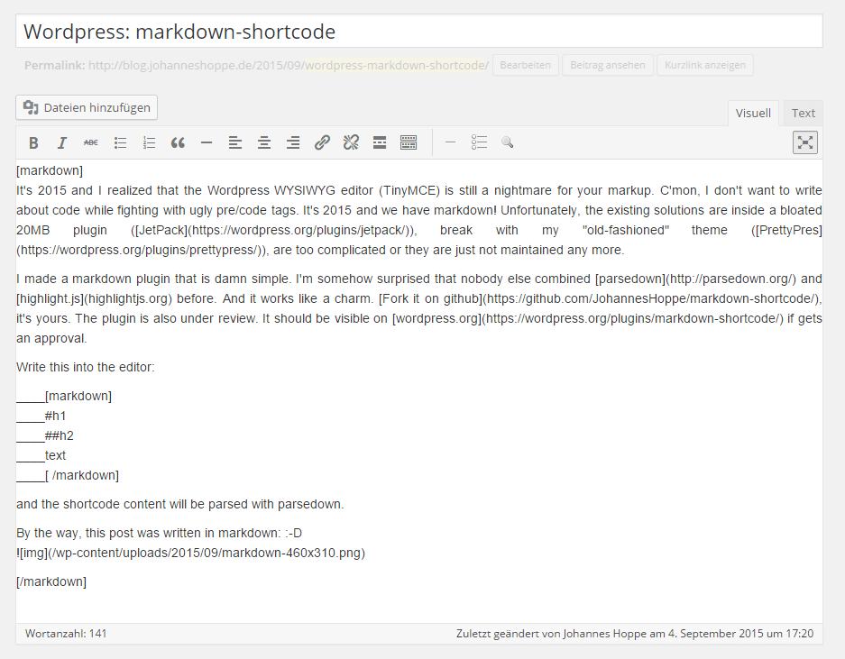
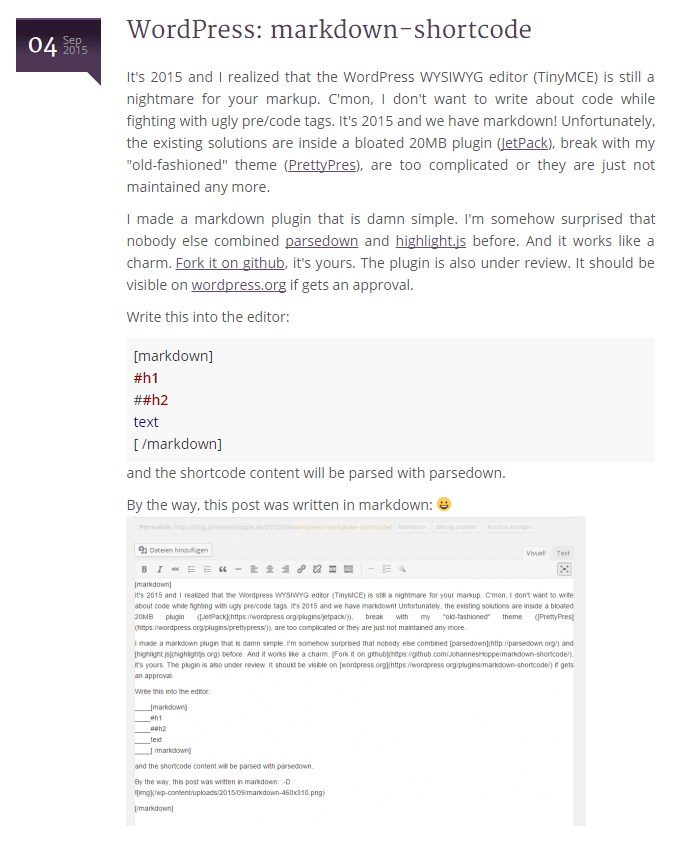

# markdown-shortcode

Damn simple [markdown]#via shortcode[/markdown] for wordpress.
This plugin uses [parsedown](http://parsedown.org/) and [highlight.js](http://highlightjs.org). Zero configuration.

Write this into the editor:

    [markdown]  
    #h1  
    ##h2  
    text  
    ____source code (two ore more underscores will be replaced by empty spaces)  
    ____source code (two ore more underscores will be replaced by empty spaces)  
    
    ```javascript
    source code
    ```
    [/markdown]

and the shortcode content will be parsed with parsedown. Syntax highlighting will appear for the source codes. 

This plugin is available at [github](https://github.com/JohannesHoppe/markdown-shortcode), too.
Please report issues at __github__, pull requests are welcome, too! 

## Installation
1. Upload the `markdown-shortcode` directory to the `/wp-content/plugins` directory.
2. Activate the plugin through the plugins menu in WordPress.
3. Use it by wrapping text in the shortcode

## Frequently Asked Questions
### Will it work in the Visual Editor?

Yes. You can switch between Visual and Text(HTML) mode. The plugin converts html entities back to the original characters.

### The WYSIWYG editor (TinyMCE) is removing empty spaces!

Indeed, TinyMCE is well-known for destroying markup. Replace empty spaces with underscores __ .
Underscores will be converted to empty spaces right before markdown conversion.


## Screenshots ##

### Screenshot 1 (Blog post written in markdown)



### Screenshot 2 (Same blog post on front end)

 
 
## Changelog

see https://github.com/JohannesHoppe/markdown-shortcode/releases for a list of all releases

